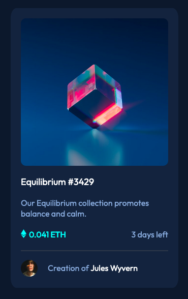

# Frontend Mentor - NFT preview card component solution

This is a solution to the [NFT preview card component challenge on Frontend Mentor](https://www.frontendmentor.io/challenges/nft-preview-card-component-SbdUL_w0U). Frontend Mentor challenges help you improve your coding skills by building realistic projects. 

## Table of contents

- [Overview](#overview)
  - [The challenge](#the-challenge)
  - [Screenshot](#screenshot)
  - [Links](#links)
- [My process](#my-process)
  - [Built with](#built-with)
  - [What I learned](#what-i-learned)
  - [Continued development](#continued-development)
  - [Useful resources](#useful-resources)
- [Author](#author)

## Overview

### The challenge

Users should be able to:

- View the optimal layout depending on their device's screen size
- See hover states for interactive elements

### Screenshot

### Links

- Solution URL: [Github](https://github.com/JohnMichaelD/NFT-preview-card-component)
- Live Site URL: [Live Site](https://johnmichaeld.github.io/NFT-preview-card-component/)

## My process

### Built with

- Semantic HTML5 markup
- CSS custom properties
- Flexbox
- CSS Grid
- Mobile-first workflow

### What I learned

From this quick project, I was able to practice my HTML and CSS skills and create an NFT card from a design. 

This was my first time adding a hover to an image, and had some complexities when needing to add an image to the image hover, as well as centering it. I also had some issues with the deployment actually showing the hover. 

### Continued development

This was a great way to knock out a quick project and practice my skills. I would like to keep practicing with FlexBox, Grid, and begin using frameworks for future projects like SASS, and also begin introducing JS.

### Useful resources

- [W3Schools - Image Hover](https://www.w3schools.com/css/tryit.asp?filename=trycss_css_image_overlay_fade) - This helped me get the start on the hover for the image.

## Author

- Website - [John Darrin](https://www.johnmdarrin.com)
- Frontend Mentor - [@JohnMichaelD](https://www.frontendmentor.io/profile/JohnMichaelD)
- Twitter - [@_JohnMichael_D](https://twitter.com/_JohnMichael_D)